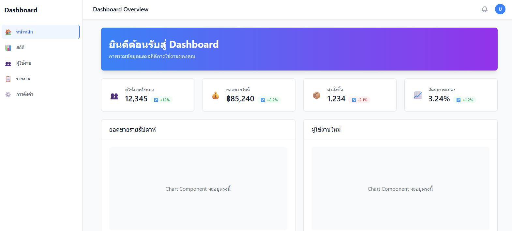

# Requestment
```
docker -v
Docker version 28.2.2, build e6534b4

node -v
v22.14.0

npm -v
11.3.0
```
---

# Docker & Node.js Setup on Ubuntu

This guide provides a quick reference for **removing old Docker and Node.js installations** and **installing the latest versions** using official methods on Ubuntu.

---

## 🔄 Remove Old Docker Installation

```bash
sudo systemctl stop docker
sudo apt-get purge -y docker* containerd runc
sudo rm -rf /var/lib/docker /etc/docker /var/run/docker.sock
sudo groupdel docker
sudo apt-get autoremove -y && sudo apt-get autoclean

or
chmod +x remove_docker.sh
sudo ./remove_docker.sh
```

---

## 🐳 Install Docker (Official Docker Engine)

### Step 1: Install dependencies
แนะนำ: ใช้ apt install docker.io หรือ ติดตั้งจาก Docker official repo
หากไม่ต้องการยุ่งกับ Snap หรือ Podman
```bash
sudo apt update
sudo apt install -y ca-certificates curl gnupg

# เพิ่ม Docker GPG key
sudo install -m 0755 -d /etc/apt/keyrings
curl -fsSL https://download.docker.com/linux/ubuntu/gpg | \
  sudo gpg --dearmor -o /etc/apt/keyrings/docker.gpg

# เพิ่ม Docker repository
echo \
  "deb [arch=$(dpkg --print-architecture) signed-by=/etc/apt/keyrings/docker.gpg] \
  https://download.docker.com/linux/ubuntu $(lsb_release -cs) stable" | \
  sudo tee /etc/apt/sources.list.d/docker.list > /dev/null

# อัปเดต repo และติดตั้ง
sudo apt update
sudo apt install -y docker-ce docker-ce-cli containerd.io docker-buildx-plugin docker-compose-plugin

docker --version
docker compose version
```

### หรือถ้าต้องการเวอร์ชันล่าสุด:
```bash
# ติดตั้ง Docker จาก official repo (ทาง Docker แนะนำวิธีนี้)
curl -fsSL https://get.docker.com -o get-docker.sh
sudo sh get-docker.sh
```

### Step 3: อย่าลืมเพิ่ม user เข้า group docker เพื่อไม่ต้องใช้ sudo ทุกครั้ง:
```bash
sudo usermod -aG docker $USER
```

### Step 4: Add current user to docker group
```bash
sudo usermod -aG docker $USER
exec su -l $USER
```

### Step 5: Verify Docker
```bash
sudo service docker start
sudo docker run hello-world

```

# ลบ Node ที่ติดตั้งผ่าน apt (กรณีติดตั้งจาก apt repository)
```
sudo apt remove nodejs
sudo apt purge nodejs
sudo apt autoremove
```

# รันคำสั่งนี้เพื่อติดตั้ง nvm:
```
curl -o- https://raw.githubusercontent.com/nvm-sh/nvm/v0.39.7/install.sh | bash
```
โหลด nvm เข้าสู่ shell (ใช้ zsh):
```
source ~/.zshrc
or
source ~/.bashrc
```
ตรวจสอบว่า nvm ติดตั้งสำเร็จ:
```
command -v nvm
```

---

## 🚀 Install Node.js v22.x LTS with NVM

### Step 1: Install NVM
```bash
curl -o- https://raw.githubusercontent.com/nvm-sh/nvm/v0.39.4/install.sh | bash
source ~/.bashrc  # or ~/.zshrc depending on your shell
```

### Step 2: Uninstall previous Node.js versions (if any)
```bash
nvm uninstall 21.0.0
nvm uninstall 22.14.0
```

### Step 3: Install and set default Node.js v22.14.0
```bash
nvm install 22.14.0
nvm alias default 22.14.0
```

### Step 4: Update npm
```bash
npm install -g npm@11.3.0
```

---

## ✅ Final Status
- Docker installed and verified successfully
- Node.js v22.14.0 + npm v11.3.0 set up via NVM

---

## 📚 Resources
- [Docker for Ubuntu](https://docs.docker.com/engine/install/ubuntu/)
- [NVM GitHub](https://github.com/nvm-sh/nvm)
- [Node.js LTS](https://nodejs.org/en/about/releases)


การแปลงรูปแบบ line ending ระหว่างระบบ Unix (Linux/macOS ใช้ LF) และ Windows (ใช้ CRLF) เมื่อใช้ Git บน Windows
```
git config --global core.autocrlf input

git add .
```

# Step start
Run file .sh
```
chmod +x 00-run.sh
./00-run.sh
```
After running 00-run.sh, the following files will be generated:
```
fullstack-docker-app
├── backend
│   ├── Dockerfile
│   ├── Dockerfile.dev
│   ├── node_modules
│   ├── package.json
│   ├── package-lock.json
│   └── server.js
├── dev.sh
├── docker-compose.yaml
├── frontend
│   ├── create-dashboard.sh
│   ├── dashboard-dependencies.txt
│   ├── Dockerfile
│   ├── Dockerfile.dev
│   ├── eslint.config.js
│   ├── index.html
│   ├── nginx.conf
│   ├── node_modules
│   ├── package.json
│   ├── package-lock.json
│   ├── postcss.config.js
│   ├── public
│   ├── README.md
│   ├── src
│   ├── tailwind.config.js
│   └── vite.config.js
└── init_tables.sql
```
# Complete 
```
✅ Project created successfully!
📁 Directory: fullstack-docker-app
🚀 To start development environment: ./dev.sh
🌐 Access points:
   Frontend: http://localhost
   Backend API: http://localhost:3050
   pgAdmin: http://localhost:5050
```
# Step end
Frontend: http://localhost

Backend API: http://localhost:3050

pgAdmin: http://localhost:5050

Edit file on vscode Ubuntu
```
sudo chown -R $USER:$USER .
```
Image : 


Delete container
```
docker compose down -v

[+] Running 7/7
 ✔ Container pgadmin_web                      Removed                                                                                                  1.1s
 ✔ Container frontend_app                     Removed                                                                                                  0.3s
 ✔ Container backend_api                      Removed                                                                                                  0.2s
 ✔ Container postgres_db                      Removed                                                                                                  0.1s
 ✔ Volume fullstack-docker-app_postgres_data  Removed                                                                                                  0.0s
 ✔ Volume fullstack-docker-app_pgadmin_data   Removed                                                                                                  0.0s
 ✔ Network fullstack-docker-app_app-network   Removed                                                                                                  0.2s
```
